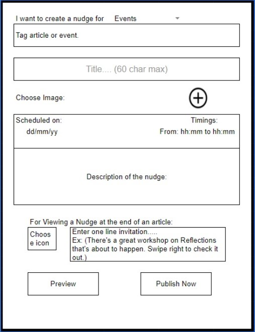

<br/>

<h1 align="center">DT Backend WebDev Challange</h1>

<br/>

# Task 2 - API documentation

<p align="center">
Wireframe</p>

<br/>

---
## Object Model for this wireframe
---

| Properties | Type | Description |
| ---        | ---  |  ---        |
| name | String | Name for nudge |
| tag | String | Tags for article or event |
| title | String | Title for nudge 60 char max |
| image | String (base64) | Image file as base64 |
| scheduleDay | Date | Schedule date as dd/mm/yy  |
| scheduleTime | String | Schedule time as hh:mm to hh:mm |
| description | String | Description of the nudge |
| icon | String (base64) | Icon file as base64 |
| invitation | String | One line invitation |
| nudgeId | string | Unique id for each new nudge |

<br/>

---
## Details for Nudge API creation
---

|Request Type | Base URL | API Endpoint | Payload | Description |
| --- | --- | --- | --- | --- |
| GET | /api/app | /nudge/?id=:nudge_id | Nothing | Gets an nudge by its unique id |
| GET | /api/app | /nudge?type=latest&limit=5&page=1 | Nothing | Gets nudge by its recency & pagination results by page number and limit of nudges per page |
| POST | /api/app | /nudge | name , tag, title, image, scheduleDay, scheduleTime, description, icon, and invitation | Create an nudge and returns the Id of the nudge that is created |
| PUT | /api/app | /nudge/:id | Same as POST payload | Update nudge that matches id in database and send response as successfull |
| DELETE | /api/app | /nudge/:id | Nothing | Delete nudge that matches id in database and send response as successfull |

<br/>

---
## CRUD Functionalities
---

- Base Url for all CRUD functions: "/api/app"

## CREATE Nudge 

- Endpoint: "/nudge"
- Request method: "POST".
- Headers:
```
{
    'Content-Type': 'application/json'
}
```
- Body: 
```
{
    name: "create nudge for event name",
    tag: "Tag article or event",
    title: "Title 60 char max",
    image: "String Base64 image",
    scheduleDay: DD:MM:YY,
    scheduleTime: "hh:mm hh:mm",
    description: "Description of the nudge"
    icon: "String bas64 icon",
    invitation: "One line invitation message"
}
```

- Response receive:
```
{ nudge_id: "436gjdf8763489" }
```
<br/>

## READ Single Nudge 

- Endpoint: "/nudge/?id=:nudge_id" 
- Request method: "GET".
- Headers and body should be empty.
- Response receive:
```
{
    name: "create nudge for event name",
    tag: "Tag article or event",
    title: "Title 60 char max",
    image: "String Base64 image",
    scheduleDay: DD:MM:YY,
    scheduleTime: "hh:mm hh:mm",
    description: "Description of the nudge"
    icon: "String bas64 icon",
    invitation: "One line invitation message"
    nudge_id: "436gjdf8763489"
}
```
<br/>

## READ Multiple Nudge 

- Endpoint: "/nudge?type=latest&limit=5&page=1" 
- Request method: "GET".
- Headers and body should be empty.
- Response receive:
```
[
    {
        name: "create nudge for event name",
        tag: "Tag article or event",
        title: "Title 60 char max",
        image: "String Base64 image",
        scheduleDay: DD:MM:YY,
        scheduleTime: "hh:mm hh:mm",
        description: "Description of the nudge"
        icon: "String bas64 icon",
        invitation: "One line invitation message"
        nudge_id: "436gjdf8763489"
    },
    ...
]    
```
<br/>

## UPDATE Nudge 

- Endpoint: "/nudge/:id"
- Request method: "PUT".
- Headers:
```
{
    'Content-Type': 'application/json'
}
```
- Body: 
```
{
    name: "create nudge for event name",
    tag: "Tag article or event",
    title: "Title 60 char max",
    image: "String Base64 image",
    scheduleDay: DD:MM:YY,
    scheduleTime: "hh:mm hh:mm",
    description: "Description of the nudge"
    icon: "String bas64 icon",
    invitation: "One line invitation message"
}
```

- Response receive:
```
{ message: "Nudge updated successfully" }
```
<br/>

## DELETE Nudge 

- Endpoint: "/nudge/:id"
- Request method: "DELETE".
- Headers and body should be empty.
- Response receive:
```
{ message: "Nudge deleted successfully" }
```
<br/>

